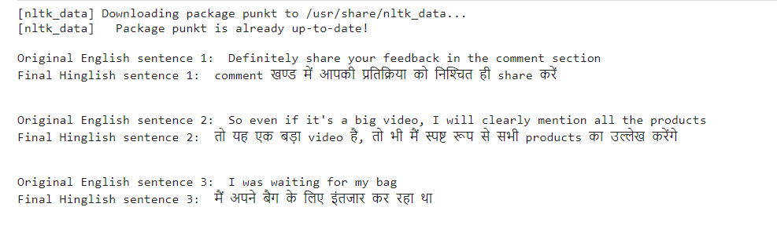

# AI-ML-Assignment-3 - Translation-Assignment

Hi my name is **Gaurav Gupta**. The model takes English sentences and translates them into Hinglish sentences.

# Input
* English Sentence is taken as the input

# Output
* Hinglish Sentence is the ouput

# Sample Image of Input and Output

# Model Used
Pre-trained **MarianMTModel** is used to convert sentence from English to Hindi. 
